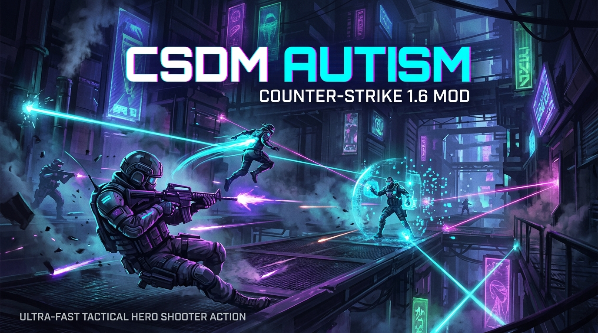
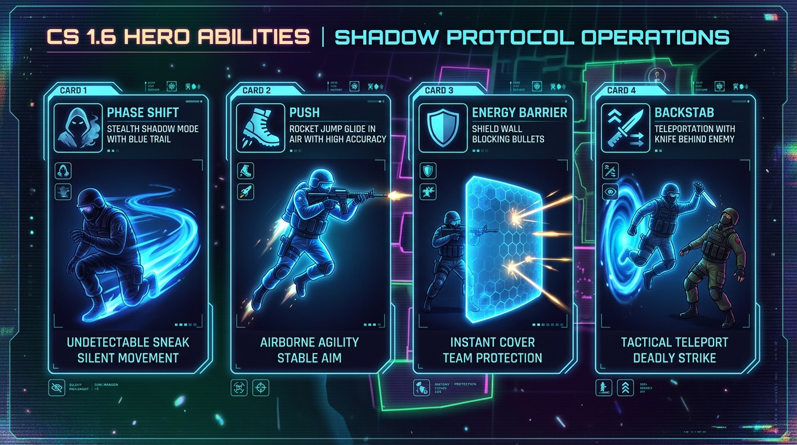

# 🎮 CSDM AUTISM — Hero & Ability Deathmatch for Counter-Strike 1.6

<p align="center">
  
</p>

<p align="center">
  
  
  
  
  
</p>

---

## ⚡ О проекте

**CSDM AUTISM** — это авторская модификация для **Counter-Strike 1.6**, превращающая классический CSDM в ультра-динамичный **Hero / Ability Tactical Shooter** (в духе *Valorant* и *Overwatch*).

Сборка включает набор уникальных способностей перемещения и защиты, продвинутое CSDM-ядро, глубокую клиентскую настройку визуала (RGB-туман, лазерные трассера, FOV, Wallhack/ESP, авто-бхоп), динамическую систему скинов оружия со своими звуками, серии убийств Valorant и умных ботов YaPB.

---

## 🔮 Способности героев (Abilities)

<p align="center">
  
</p>

> 💡 **Главное правило всех способностей:**
> Совершение убийства любого противника **мгновенно сбрасывает кулдаун** всех способностей!

---

### 1. 💨 Phase Shift («Уход в тень»)
* **Команда консоли:** `ability_phase`
* **Кулдаун:** 15 секунд *(сброс при килле)*
* **Длительность:** 5 секунд
* **Эффекты:**
  * Полная неуязвимость к любому урону (`damage = 0`).
  * Скорость бега увеличивается до **750 units/s** (базовая скорость 250).
  * Полупрозрачность модели (Stealth) и неоновый лазерный след за спиной.
  * Экран окрашивается в неоново-синий оттенок.
  * **Прерывание атакой:** нажатие ЛКМ или ПКМ мгновенно рассеивает тень для неожиданного удара.

---

### 2. 🚀 Push & Glide («Реактивный толчок и Парение»)
* **Команда консоли:** `ability_push`
* **Кулдаун:** 3 секунды *(сброс при килле)*
* **Эффекты:**
  * **Импульсный толчок:** толкает игрока в противоположную сторону от прицела. При взгляде в пол игрок взмывает высоко в воздух.
  * **Парение (Glide):** в воздухе вертикальная скорость падения замедляется до `-75.0` (медленный планирующий спуск, как у Jett). Повторное нажатие отменяет парение.
  * **100% точность в воздухе:** сервер убирает разброс стрельбы во время полета — пули летят точно в центр прицела!
  * **Полная защита от урона при падении** с любой высоты.

---

### 3. 🛡️ Energy Barrier («Энергетический щит / Стена»)
* **Команда консоли:** `ability_wall`
* **Кулдаун:** 8 секунд *(сброс при килле)*
* **Длительность:** 4 секунды
* **Эффекты:**
  * Создает перед игроком монолитную световую стену из 3 блоков и 6 бирюзовых лазерных линий.
  * **Односторонняя защита:** пули противников на 100% блокируются стеной.
  * **Прострел для владельца:** создатель стены может **стрелять сквозь нее с полным уроном** и свободно проходить сквозь неё.

---

### 4. ⏳ Recall («Возврат во времени»)
* **Команда консоли:** `ability_recall`
* **Кулдаун:** 15 секунд *(сброс при килле)*
* **Эффекты:**
  * Сервер каждые 0.1 сек фиксирует 40 снапшотов состояния игрока.
  * При активации возвращает игрока на позицию, где он находился **ровно 4 секунды назад**.
  * Полностью восстанавливает тогдашнее количество **HP и брони**.
  * Встроен умный алгоритм Anti-stuck: предотвращает застревание в стенах или текстурах пола при смене позы (стоя/присед).

---

### 5. 🗡️ Backstab Teleport («Телепорт за спину»)
* **Команда консоли:** `ability_teleport`
* **Кулдаун:** 5 секунд *(сброс при килле)*
* **Эффекты:**
  * Захватывает врага в конусе прицела на дистанции до 2000 юнитов (с проверкой прямой видимости).
  * Находит безопасную позицию за спиной цели и мгновенно телепортирует туда игрока.
  * **Замедление жертвы:** скорость цели падает до 150 на 1.5 секунды.
  * **Авто-бэкстаб:** мгновенно берет в руки нож и обнуляет задержку атаки для моментального удара в спину.

---

## 🎯 CSDM Ядро (`csdm_core.sma`)

* **Бесконечный матч:** цели карт (бомбплейсы, заложники, зоны закупки) автоматически вырезаются.
* **Быстрый респавн:** воскрешение через 2.0 секунды.
* **Умный подбор спавнов:** подбирает точку возрождения на расстоянии не менее 600 юнитов от живых врагов.
* **Защита спавна:** 3 секунды бессмертия с цветным свечением (снимается при первом выстреле).
* **Награды за фраги:** каждое убийство восстанавливает **+30 HP** и пополняет магазин патронов.
* **Бафф Deagle:** при скорости ходьбы менее 120 юнитов точность Дигла фиксируется на 0.95, а отдача срезается на 70%.
* **Режимы FFA / TDM:** поддержка как классического командного DM, так и Free For All («все против всех»).
* **Бесконечные патроны:** автоматическое пополнение резервных патронов до 200.
* **Кастомные модели:** автоматическая выдача модели `Asuka` для живых игроков.

---

## 🎨 Визуальный комбайн (`custom_fog.sma`)

* 🌫️ **Туман (Fog):** персональный выбор R/G/B, плотности и режим плавной радуги (RGB Rainbow).
* 🌈 **Трассера:** цветные лазерные следы пуль.
* 🔭 **FOV:** персональный угол обзора от 10° до 150° (с авто-возвратом зума снайперок).
* 🐰 **Bunnyhop:** встроенная авто-распрыжка со снятием штрафа скорости приземления.
* 👁️ **Wallhack / ESP:** 2D рамки на игроках, дистанционные лазерные лучи к целям, заливка силуэтов свечением (Glow).
* 💥 **Индикатор урона:** вывод выбитого дамага (Large DHUD и Small HUD) с градиентом от желтого к красному.
* 🔫 **Система скинов оружия:** поддержка кастомных скинов для Knife, M4A1, AK-47 с авто-сменой при доставании/килле и заменой звуков стрельбы и ударов.
* 💾 **nVault:** все персональные настройки игроков сохраняются по SteamID/AuthID.

---

## ⌨️ Рекомендуемые бинды и команды

### Бинды способностей:
Пропишите в консоли игры (`~`):
```cfg
bind "q" "ability_push"       // Толчок назад/вверх и парение
bind "e" "ability_wall"       // Установка защитной стены
bind "f" "ability_phase"      // Уход в тень (Phase Shift)
bind "c" "ability_recall"     // Возврат во времени (Recall)
bind "v" "ability_teleport"   // Телепорт за спину (Backstab)
```

### Бинды управления ботами (YaPB):
```cfg
bind "RIGHTARROW" "yb add"    // Стрелка вправо — добавить 1 случайного бота
bind "LEFTARROW"  "yb kick"   // Стрелка влево  — убрать 1 бота
bind "UPARROW"    "yb menu"   // Стрелка вверх  — открыть меню ботов
bind "DOWNARROW"  "yb killall"// Стрелка вниз   — убить всех ботов
bind "F5"         "amx_dummy" // Заморозить ботов в манекены с 1 млн HP
```

### Основные меню сервера:
* `/guns` (или `guns`) — Меню выбора оружия и настройки CSDM (FFA/TDM, сложность ботов, спавны).
* `amx_custom_menu` — Главное меню визуальных настроек (Туман, Скины, FOV, Трассера, Бхоп, WH).
* `/spawns` — Внутриигровой редактор точек спавна на лазерах (требуются права администратора).
* `/dummy` (или `/bot1m`) — Режим тренировочных мишеней.

---

## 📁 Структура репозитория

```
├── addons/
│   ├── amxmodx/
│   │   ├── configs/           # Конфиги CSDM, плагинов, спавнов карт
│   │   ├── plugins/           # Скомпилированные .amxx плагины
│   │   └── scripting/         # Исходники .sma и заголовочные .inc
│   ├── metamod/               # Модуль Metamod
│   └── yapb/                  # Движок умных ботов YaPB
├── assets/                    # Графика и скриншоты для README
├── gfx/                       # Небосводы (Skyboxes)
├── maps/                      # Карты сервера
├── models/                    # Модели игроков (Asuka) и скинов оружия
├── sound/                     # Звуки Valorant и звуки скинов оружия
└── sprites/                   # Лазеры, трассера и спецэффекты
```

---

<p align="center">
  Разработано с ❤️ для любителей динамичного олдскульного CS 1.6 в новом формате.
</p>
